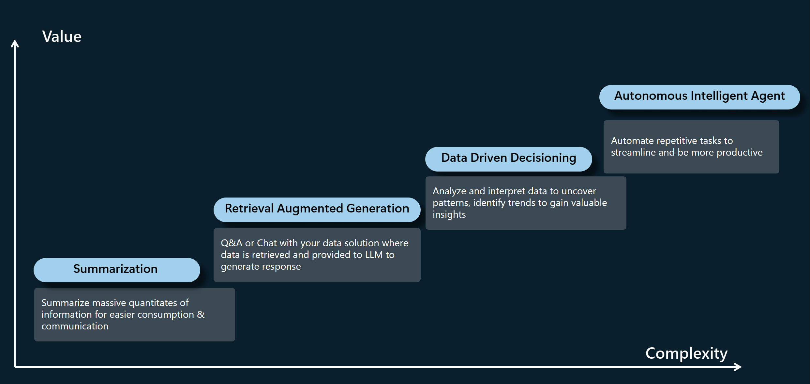

## Azure Open AI Landing Zone Solution Accelerator
### Overview
The goal of this landing zone solution accelerator is to help you quickly set up your development and production environments for your Generative AI solution built with Azure Open AI and Azure Services. We provide deployment templates for common Gen AI solution patterns and allow you to customize based on your own scenario. We also recommend best practices about technologies to use in each scenario.
### How to use this solution accelerator
Start with the foundation section where you will find guidelines and templates to setup common infrastructure for all Gen AI application scenarios such as Azure Open AI service, Azure AI studio and network security.
Then depending on your application scenario, follow one of the patterns below to setup services specific to your scenario.

### Review of Gen AI solution scenarios
- GenAI is a rapidly growing field so the application patterns are also changing quickly. We try to capture the major patterns we observe as of the release of this repository. 
- Your scenario may belong to one of the following pattern or it can be a combination of some of them. There are of courses application scenarios that are not listed here however for technology deployment, you may still benefit from our templates.

### [Setup Foundation Infrastructure](./foundation/)
### Setup Scenario Specific Services  
- #### [Summarization](./scenarios/summarization/)
- #### [Retrieval Augmented Generation](./scenarios/rag/)
- #### [Data Driven Decisioning](./scenarios/data_driven_decisioning/)
- #### [Autonomous Intelligent Agent](./scenarios/autonomous_agent/)

## Contributing

This project welcomes contributions and suggestions.  Most contributions require you to agree to a
Contributor License Agreement (CLA) declaring that you have the right to, and actually do, grant us
the rights to use your contribution. For details, visit https://cla.opensource.microsoft.com.

When you submit a pull request, a CLA bot will automatically determine whether you need to provide
a CLA and decorate the PR appropriately (e.g., status check, comment). Simply follow the instructions
provided by the bot. You will only need to do this once across all repos using our CLA.

This project has adopted the [Microsoft Open Source Code of Conduct](https://opensource.microsoft.com/codeofconduct/).
For more information see the [Code of Conduct FAQ](https://opensource.microsoft.com/codeofconduct/faq/) or
contact [opencode@microsoft.com](mailto:opencode@microsoft.com) with any additional questions or comments.

## Trademarks

This project may contain trademarks or logos for projects, products, or services. Authorized use of Microsoft 
trademarks or logos is subject to and must follow 
[Microsoft's Trademark & Brand Guidelines](https://www.microsoft.com/en-us/legal/intellectualproperty/trademarks/usage/general).
Use of Microsoft trademarks or logos in modified versions of this project must not cause confusion or imply Microsoft sponsorship.
Any use of third-party trademarks or logos are subject to those third-party's policies.

