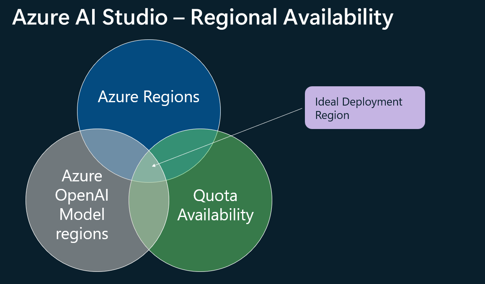

# Azure AI Studio Bicep Deployment

This repo deploy Azure AI studio into an existing VNet and retrieves the DNS names and IP addresses of the private endpoints created.

### Azure AI Studio Landing Zone components

The diagram shows the components of Azure AI studio which can be deployed using the bicep deployments


Enterprise teams can deploy the Azure studio components within an Azure Virtual network as shown below. 


Azure AI Projects supports the following components


Azure Studio AI supports two modes Virtual Network integration. 

1. [Managed VNet ](https://learn.microsoft.com/en-us/azure/ai-studio/how-to/configure-managed-network?tabs=azure-cli)
    
2. [Private Link](https://learn.microsoft.com/en-us/azure/ai-studio/how-to/configure-private-link?tabs=cli)


Please see this Azure Doc more information. 

This repo supports both modes of the virtual network integration.


## Prerequisites

To deploy Azure AI studio using Bicep, you need to have the following:

- **New or Existing Resource Group**: Ensure you have a new or an existing resource group with contributor permissions.
- **Azure OpenAI Enabled**: Azure OpenAI service must be enabled on your Azure subscription.
- **Existing Virtual Network (VNet)**: A VNet should be pre-provisioned with permissions to deploy a Private Endpoint in a subnet. Connectivity to the VNet should be established from on-premises or local machine. 
- ** If you want to deploy into a new Vnet, please see this [link](https://github.com/Azure/azure-quickstart-templates/tree/master/quickstarts/microsoft.machinelearningservices/aistudio-network-restricted)
- **Existing Private DNS Zone**: You should have a private DNS zone for the below DNS names. The Private DNS Zones 
should already have virtual network links to the VNet.
    
    ```
    privatelink.blob.core.windows.net
    privatelink.file.core.windows.net
    privatelink.vaultcore.azure.net
    privatelink.api.azureml.ms
    privatelink.azurecr.io
    privatelink.cognitiveservices.azure.com
    privatelink.openai.azure.com
    privatelink.notebooks.azure.net

    ```
- **Resource Group Names**: Know the resource group names for your VNet and private DNS zones.
- **Azure CLI**: The Azure Command Line Interface (CLI) should be installed on your system.
- **Bash**: Ensure you have PowerShell (for Windows) or Bash (for Linux/Mac) installed.
- **Azure Portal Login**: Make sure you are logged into the Azure Portal using the Azure CLI.
- **Usernames**: Prepare a list of usernames (in the format `username@domain.com`) that need to be provisioned.
- **DNS Forwarding**: DNS conditional forwarding will be required if multiple Azure AI resources as provisioned as documented [here](https://learn.microsoft.com/en-us/azure/machine-learning/how-to-custom-dns?view=azureml-api-2&tabs=azure-cli#example-custom-dns-server-hosted-in-vnet).

## Regional Availability




Please refer to the regional availability of the Azure AI resources:

- [Azure AI Studio](https://azure.microsoft.com/en-us/global-infrastructure/services/?products=machine-learning-service)
- [Azure Regions](https://azure.microsoft.com/en-us/explore/global-infrastructure/geographies/#geographies)

- [Azure OpenAI Models and region availability](https://learn.microsoft.com/en-us/azure/ai-services/openai/concepts/models#model-summary-table-and-region-availability)


## Deployment Steps

### Azure Login Steps

Follow these steps to log into your Azure account using the Azure CLI.

1. **Login to Azure**: Use the Azure CLI to log into your Azure account.

    Copy and paste the following command into your terminal or command prompt:
    ```
    az login
    ```

2. **Set Your Azure Subscription**:

    Replace `<your-subscription-id>` with your actual Azure subscription ID:
    ```
    az account set --subscription "<your-subscription-id>"
    ```

3. **Deploy to Azure Resource Group using Bash**:

    Replace `<resource-group>` with your Azure resource group:
    ```
    git clone https://github.com/Azure/azure-openai-landing-zone
    cd azure-openai-landing-zone/foundation/aistudio-infra/scripts

4. **Update Bicep param file**:
    Edit the `azure-ai.bicepparam` file to update the parameters:

    ```
    param aiHubName = 'demo' // e.g 'azure-ai-7uj23hng7h22c-westus'. Leave it blank create a new AI resource with a random UUID.
    param aiHubFriendlyName = 'Demo AI resource'
    param aiHubDescription = 'This is an example AI resource for use in Azure AI Studio.'
    param tags = {}
    param vnetName = 'your-vnet-name'
    param vnetRgName = 'your-vnet-resource-group'
    param subnetName = 'your-subnet-name'
    param location = 'your-location'
    param prefix = 'prefix'


    param blobPrivateDnsZoneRg = 'aml-rg'
    param filePrivateDnsZoneRg = 'vnet'
    param vaultPrivateDnsZoneRg = 'vnet'
    param azuremlApiPrivateDnsZoneRg = 'openai'
    param azurecrPrivateDnsZoneRg = 'vnet'
    param cognitiveServicesPrivateDnsZoneRg = 'vnet'
    param openAiPrivateDnsZoneRg = 'vnet'
    param notebooksPrivateDnsZoneRg = 'openai'
    

    # This script calls the bicep file to deploy the AI Studio components based on the input parameters. 
    # This script also configures python environment and install pip packages required for the tests.
    ./provision_ai_studio.sh

    The script will prompt for the following parameters:
    
    RESOURCE_GROUP_NAME=<your Resource Group Name>
    LOCATION=<your Azure Region>
    NEW_AI_RESOURCE=<whether new Azure AI resource needs to be created>

    ```
    This scripts outputs the DNS names and IP addresses of the private endpoints created. For e.g.:

    ```
    10.0.2.110 c4524ea0-cca1-4f75-81a6-bc48263e1284.workspace.westus.api.azureml.ms
    10.0.2.110 c4524ea0-cca1-4f75-81a6-bc48263e1284.workspace.westus.cert.api.azureml.ms
    10.0.2.111 ml-ai-c2u66zp7iicfc-westus-c4524ea0-cca1-4f75-81a6-bc48263e1284.westus.notebooks.azure.net
    10.0.2.112 *.c4524ea0-cca1-4f75-81a6-bc48263e1284.inference.westus.api.azureml.ms
    10.0.2.105 sac2u66zp7iicfc.blob.core.windows.net
    10.0.2.106 sac2u66zp7iicfc.file.core.windows.net

    ```
    This information can be used to configure DNS forwarding to the private DNS zone. 

5. **Test Azure AI resource Endpoint**:

    For a local testing without DNS forwarding, add the above DNS name and IP address to hosts file and run the below script. 
    The below scripts initiates a chatbot converation with the deployed Azure AI resource using promptflow CLI. 

      ```
      cd azure-openai-landing-zone/foundation/aistudio-infra/tests
      ./pftest.sh
      ```

    Script in action:
    

### Limitations

1. Private Azure AI services and Azure AI Search aren't supported.
2. The "Add your data" feature in the Azure AI Studio playground doesn't support private storage account.
3. You might encounter problems trying to access the private endpoint for your hub if you're using Mozilla Firefox. This problem might be related to DNS over HTTPS in Mozilla Firefox. We recommend using Microsoft Edge or Google Chrome.


 