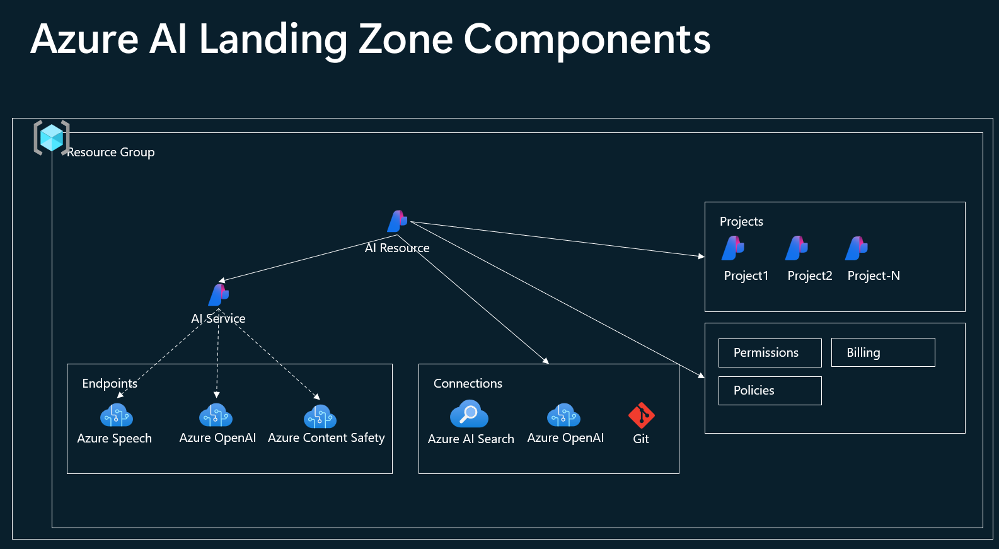
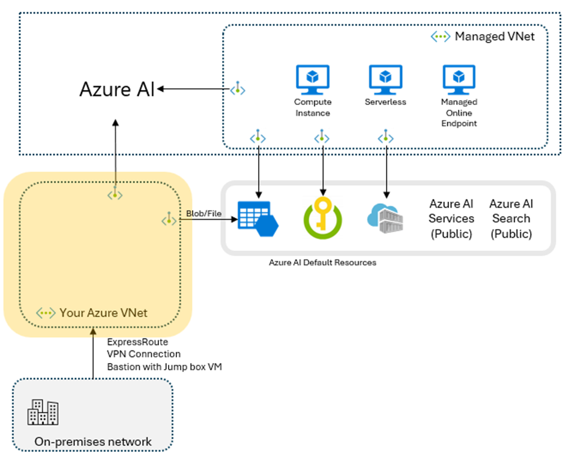
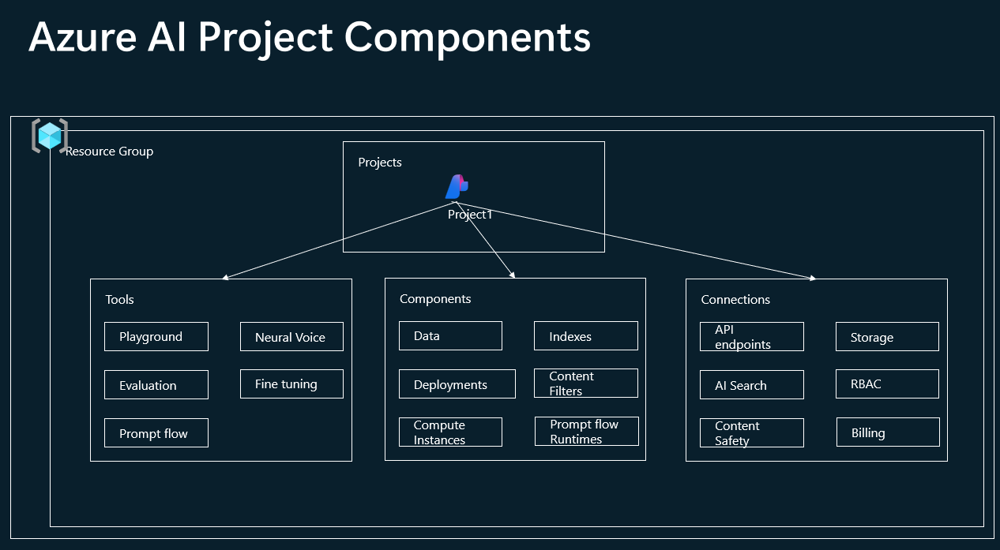
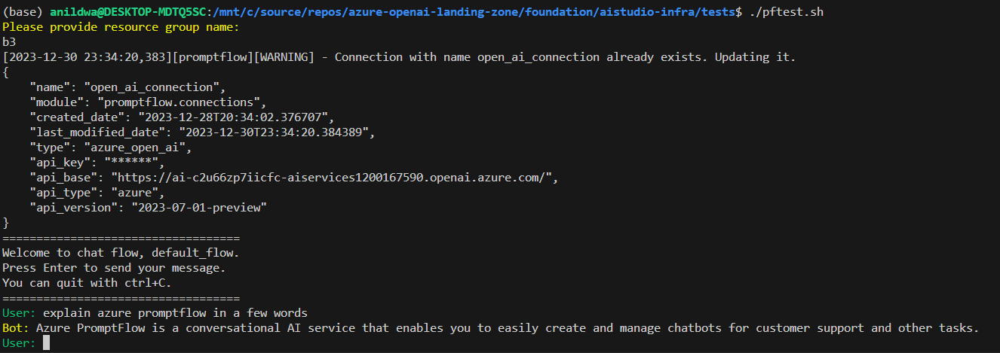

# Azure AI Studio Bicep Deployment

### Azure AI Studio Landing Zone components

The diagram shows the components of Azure AI studio which can be deployed using the bicep deployments



Enterprise teams can deploy the Azure studio components within an Azure Virtual network as shown below. 




Azure AI Projects supports the following components



Azure Studio AI supports two modes Virtual Network integration. 

1. [Managed VNet ](https://learn.microsoft.com/en-us/azure/ai-studio/how-to/configure-managed-network?tabs=azure-cli)
    
2. [Private Link](https://learn.microsoft.com/en-us/azure/ai-studio/how-to/configure-private-link?tabs=cli)


Please see this Azure Doc more information. 

This repo supports both modes of the virtual network integration.


## Prerequisites

To deploy Azure AI studio using Bicep, you need to have the following:

- **New or Existing Resource Group**: Ensure you have a new or an existing resource group with contributor permissions.
- **Azure OpenAI Enabled**: Azure OpenAI service must be enabled on your Azure subscription.
- **Existing Virtual Network (VNet)**: A VNet should be pre-provisioned with permissions to deploy a Private Endpoint in a subnet.
- **Existing Private DNS Zone**: You should have a private DNS zone for the below DNS names. 
    
    ```
    privatelink.blob.core.windows.net
    privatelink.file.core.windows.net
    privatelink.search.windows.net
    privatelink.vaultcore.azure.net
    privatelink.api.azureml.ms
    privatelink.azurecr.io
    ```
- **Resource Group Names**: Know the resource group names for your VNet and private DNS zones.
- **Azure CLI**: The Azure Command Line Interface (CLI) should be installed on your system.
- **Bash**: Ensure you have PowerShell (for Windows) or Bash (for Linux/Mac) installed.
- **Azure Portal Login**: Make sure you are logged into the Azure Portal using the Azure CLI.
- **Usernames**: Prepare a list of usernames (in the format `username@domain.com`) that need to be provisioned.
- **DNS Forwarding**: DNS conditional forwarding will be required if multiple Azure AI resources as provisioned as documented [here](https://learn.microsoft.com/en-us/azure/machine-learning/how-to-custom-dns?view=azureml-api-2&tabs=azure-cli#example-custom-dns-server-hosted-in-vnet).

## Repo folder structure

Table below describes the folder structure of the repo

| Folder | Description |
|--------|-------------|
| aistudio-infra | Contains the bicep files for the foundation components |
| aistudio-infra/bicep | Contains bicep files |
| aistudio-infra/scripts | Contains the scripts to deploy the foundation components
| aistudio-infra/tests | Contains the scripts to test the foundation components

Table below describes the bicep files in the repo

| File | Description |
|--------|-------------|
| aistudio-infra/bicep/azure-ai.bicep | Contains the bicep file to deploy the AI Studio components |
| aistudio-infra/bicep/azure-ai.bicepparam | Contains the parameters for the AI Studio components bicep file. You can modify resource names etc here.  |
| aistudio-infra/bicep/azure-ai-project.bicep | Used to provision individual projects within AI Resource  |
| aistudio-infra/bicep/azure-ai-project.bicepparam | Contains the parameters for the AI Studio project components. You can modify project name etc here.  |
| aistudio-infra/bicep/azure-ai-pe-multi.bicep | bicep module use to provision private endpoints for multiple AI resource components such as storage, key vault, AI resouces etc.  |

Resources deployed by the bicep file

| Resource | Description |
|--------|-------------|
| Azure Resource Group | Azure resource group is used to group the AI studio components. |
| Azure AI Resource | Azure AI resource is the main resource for Azure AI studio. This resource is used to provision the AI studio components. |
| Azure AI Project | Azure AI project is used to provision individual projects within the AI resource. |
| Azure Storage Account | Azure storage account is used to store the data for the AI projects. |
| Azure Key Vault | Azure key vault is used to store the secrets for the AI projects. |
| Azure AI Search | Azure AI search is used as vector store for the data for the AI projects. |
| Default Connections | Default connections to the AI Service endpoints such as Azure OpenAI, Speech etc. |
| Private Endpoints | Private endpoints for the AI Resources |
| Private DNS Zone | Private DNS zone group for the AI Resources |
| Model deployment | a gpt-35-turbo model with 1K TPM is deployed. Additional models can be deployed by modifying the azure-ai.bicep template. |


## Deployment Steps

### Azure Login Steps

Follow these steps to log into your Azure account using the Azure CLI.

1. **Login to Azure**: Use the Azure CLI to log into your Azure account.

    Copy and paste the following command into your terminal or command prompt:
    ```
    az login
    ```

2. **Set Your Azure Subscription**:

    Replace `<your-subscription-id>` with your actual Azure subscription ID:
    ```
    az account set --subscription "<your-subscription-id>"
    ```

3. **Deploy to Azure Resource Group using Bash**:

    Replace `<resource-group>` with your Azure resource group:
    ```
    git clone https://github.com/anildwarepo/azure-openai-landing-zone/
    cd azure-openai-landing-zone/foundation/aistudio-infra/scripts
    
    # This script calls the bicep file to deploy the AI Studio components based on the input parameters. 
    # This script also configures python environment and install pip packages required for the tests.
    ./provision_ai_studio.sh

    The script will prompt for the following parameters:
    
    RESOURCE_GROUP_NAME=<your Resource Group Name>
    LOCATION=<your Azure Region>
    NEW_AI_RESOURCE=<whether new Azure AI resource needs to be created>
    CREATE_PROJECT=<whether new Azure AI project needs to be created>

    ```
    This scripts outputs the DNS names and IP addresses of the private endpoints created. For e.g.:

    ```
    10.0.2.110 c4524ea0-cca1-4f75-81a6-bc48263e1284.workspace.westus.api.azureml.ms
    10.0.2.110 c4524ea0-cca1-4f75-81a6-bc48263e1284.workspace.westus.cert.api.azureml.ms
    10.0.2.111 ml-ai-c2u66zp7iicfc-westus-c4524ea0-cca1-4f75-81a6-bc48263e1284.westus.notebooks.azure.net
    10.0.2.112 *.c4524ea0-cca1-4f75-81a6-bc48263e1284.inference.westus.api.azureml.ms
    10.0.2.105 sac2u66zp7iicfc.blob.core.windows.net
    10.0.2.106 sac2u66zp7iicfc.file.core.windows.net
    10.0.2.110 a01f4093-b06e-4aaf-a2ce-dc45cdc874aa.workspace.westus.api.azureml.ms
    10.0.2.110 a01f4093-b06e-4aaf-a2ce-dc45cdc874aa.workspace.westus.cert.api.azureml.ms
    ```
    This information can be used to configure DNS forwarding to the private DNS zone. 
 
4. **Test Azure AI resource Endpoint**:

    For a local testing without DNS forwarding, add the above DNS name and IP address to hosts file and run the below script. 
    The below scripts initiates a chatbot converation with the deployed Azure AI resource using promptflow CLI. 

      ```
      cd azure-openai-landing-zone/foundation/aistudio-infra/tests
      ./pftests.sh
      ```

    Script in action:
    

### Limitations

1. Private Azure AI services and Azure AI Search aren't supported.
2. The "Add your data" feature in the Azure AI Studio playground doesn't support private storage account.
3. Prompt flow - Workspace hub / lean workspace and AI studio don't support bring your own virtual network.
[Please see this for more details.](https://learn.microsoft.com/en-us/azure/machine-learning/prompt-flow/how-to-secure-prompt-flow?view=azureml-api-2)

 

 ### Known Issues

1. New project from AI Studio shows created but project cannot be found or takes while to show up with Vnet enabled. 
2. New project creation needs storage and keyvault with publicnetwork access enabled.
3. cli is not available for AI resources and projects. Need to use Python SDK. Hence the dependency on python. 