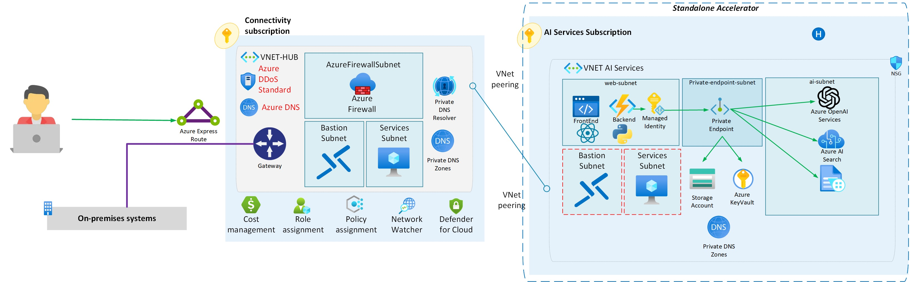

# Azure OpenAI Standalone Application Landing Zone 

## Architecture Overview




This Bicep-based deployment script describes an Azure architecture designed to index PDF documents using Azure AI Search and utilize OpenAI to ask questions about the indexed data. The standalone infrastructure aligns with Azure's well-architected framework, focusing on security and proper resource organization.

Key architectural components include:

1.  **Azure Cognitive Search**: Used to index PDF documents, facilitating quick search and retrieval of information.
2.  **Azure OpenAI**: Integrated to create intelligent questioning and answering capabilities by analyzing the indexed content.
3.  **Virtual Network (VNet)**: Networking foundation that allows communication between Azure resources.
4.  **Private Endpoints**: Ensures secure access to resources within the virtual network, minimizing exposure to the public internet.
5.  **Managed Identities**: For secure, keyless authentication to Azure services, reducing management overhead and enhancing security.
6.  **Azure Bastion**: Provides secure and seamless RDP/SSH connectivity to your virtual machines directly in the Azure portal over SSL.
7.  **Jumpbox**: Also known as a jump server, it's used as a stepping point for connecting to other servers or security zones.
8.  **Azure Function**: A serverless compute service that allows you to run event-triggered code without explicitly provisioning or managing infrastructure.
9.  **Static Web App**: A service that automatically builds and deploys full-stack web applications to Azure from a code repository.
10.  **VNet Integration**: The facility for the web components (Azure Function and Static Web App) to connect with other Azure resources through the VNet securely.

This architecture is designed with security as a priority. All the services communicate over a private network using private endpoints, and access to these services is strictly controlled through managed identities, eliminating the need for credential exchange.

For administrative tasks, a secure jumpbox and Azure Bastion are provisioned for accessing internal virtual network resources without exposing them to the public internet. Additionally, the whole architecture is planned with scalability and high availability in mind to accommodate varying workloads.

[](https://portal.azure.com/#create/Microsoft.Template/uri/https%3A%2F%2Fraw.githubusercontent.com%2FAzure%2Fazure-openai-landing-zone%2Fmain%2Ffoundation%2Fstandalone%2Fbicep%2Fmain.json)


## Web Components

For illustration and testing purposes, this deployment includes an Azure Function and a Static Web App, both publicly accessible; however, they communicate with other resources like OpenAI and Cognitive Search over private connections established via VNet Integration.

## Future Expansion Opportunities

To further enhance the security and private nature of the infrastructure:

-   **Configure Private Endpoints for the Azure Function and Static Web App**: This would add another layer of security, ensuring that all aspects of the architecture are accessible only through the VNet.
    
-   **Implement Application Gateway or Azure Front Door**: These services would act as a central entrance, providing secure public access to the Azure Function and Static Web App while maintaining strict control over both incoming and internal traffic.
    
## Prerequisites

Before proceeding with the deployment steps, ensure that you have the following prerequisites in place:

-   An Azure subscription where you have at least contributor-level access.
-   The Azure CLI installed on your local machine or Cloud Shell enabled in your Azure portal.
-   Sufficient permissions to create and manage Azure Active Directory (Azure AD) objects if setting up managed identities.
-   An existing Azure Resource Group or sufficient permissions to create one.

## Deployment Steps

### 1. Prepare the Bicep Parameter File

Before deploying the infrastructure, you need to modify the deployment parameters in the  `main.bicepparam`  file to match your desired configuration. This will include setting the appropriate resource names, locations, address prefixes, etc.

Make sure to customise the name for the following parameters, otherwise you might get conflicts:

- global name => your own name instead of oai-standalone, keep it short.
- postFix => a random postfix if needed
- env => prod,dev,test,etc.

### 2. Infrastructure Deployment

Using the Azure CLI, run the following commands to deploy the core infrastructure components. Replace  `ExampleDeployment`,  `ExampleGroup`, and  `storage.bicepparam`  with the name of your deployment, your Azure Resource Group, and your parameter file path, respectively.

```shell
az deployment group create \
  --name ExampleDeployment \
  --resource-group ExampleGroup \
  --template-file main.bicep \
  --parameters main.bicepparam

```

The output from this deployment will provide you with the resource IDs and endpoints needed for the next steps.

### 3. Deploy the Application

After successfully deploying the infrastructure, proceed to deploy the application using the instructions in the  `app`  folder. This might involve running additional commands, and you may need to navigate to the specific subdirectory where your application code resides.


### 4. Test the Azure OpenAI Standalone Application

Once both the infrastructure and the application deployments are complete, you should have a working Azure OpenAI Standalone application landing zone. At this point, you can begin testing the question-answering capabilities and interaction with Azure OpenAI services using the deployed Static Web App and Azure Function.

-   Navigate to the provided Static Web App URL to access the web application.
-   Use the Azure Function endpoint to interact with the APIs and test backend functionality.

Remember to monitor the resource usage and costs associated with this deployment, as some components like Azure OpenAI may incur higher charges.

## Additional Notes

-   **Security**: Review the security settings for all used resources, and ensure that access control is correctly configured.
-   **Monitoring and Management**: Set up Azure Monitor and Azure Alerts to keep track of any issues and to monitor the performance and health of the application.
-   **Backups**: Consider implementing a backup strategy for resources like Azure Blob Storage to prevent data loss.

By carefully following these steps, you should now have a secure and scalable Azure OpenAI-powered search and question-answering platform.
