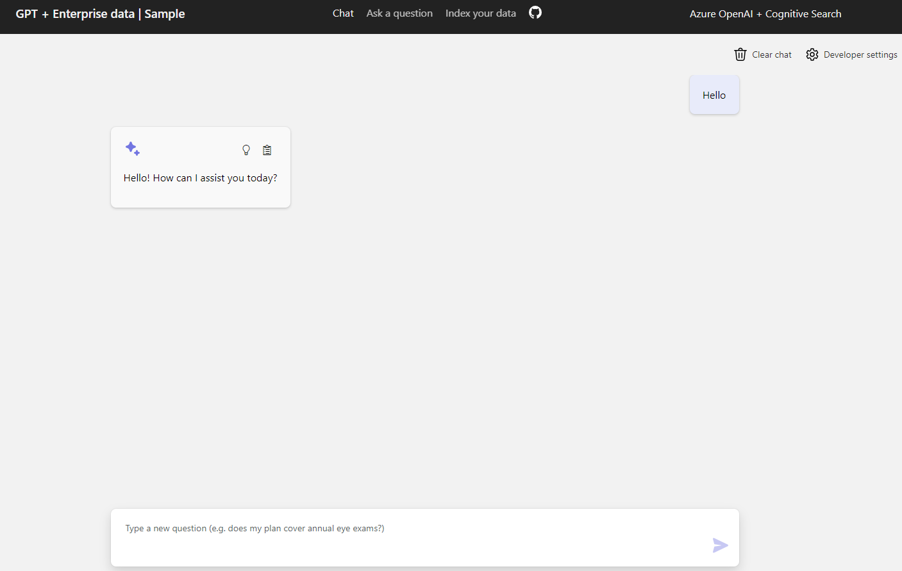

# Readme for Deploying ChatGPT + Enterprise Data with Azure OpenAI

This Azure OpenAI solution allows you to leverage the power of ChatGPT with enterprise data. It includes features like file uploads through UI, integration with Azure Cognitive Search, and the ability to use Bing Search. Below you will find instructions for deploying both the frontend and backend components of this application.

This is based on the following repository: https://github.com/lordlinus/Enterprise-ChatGPT/tree/main several modifications and corrections were done to make the code work.



## Prerequisites

- Azure infrastructure should already be deployed
-   An Azure subscription with access to Azure OpenAI service.
-   Azure Developer CLI.
-   Python 3.x with  `pip`  in the PATH.
-   Node.js.
-   PowerShell 7+ (Windows users).
-   Static Web Apps CLI.
-   Azure CLI.
-   Azure Functions Core Tools.

Ensure your Azure Account has the necessary permissions (`Microsoft.Authorization/roleAssignments/write`) like User Access Administrator or Owner.

## Backend Deployment

The backend of this application consists of Azure Functions, which are deployed using the Azure Functions Core Tools.

### Steps to Deploy Backend:

1.  Make sure you have installed all prerequisites.
2.  Open a terminal and navigate to the backend folder of your project.
3.  Login to Azure using Azure CLI by running  `az login`.
4.  Set your Azure subscription by running  `az account set --subscription "<your target subscription>"`.
6.  Deploy your backend Azure Functions using the following command:
    
    ```sh
    func azure functionapp publish <FunctionAppName> --python
    ```
    
    Replace  `<FunctionAppName>`  with the name of your Azure Function App.

## Frontend Deployment

The frontend is a Static Web App (SWA) and can be deployed using the SWA CLI.

### Steps to Deploy Frontend:

1.  Ensure that all prerequisites are installed and properly configured.
2.  Obtain the deployment token for Azure Static Web Apps. For this, you may need to navigate to your app in the Azure portal and generate/retrieve the deployment token from the Overview tab using the "Manage deployment token
" button.
1. Open a terminal and navigate to the frontend folder of your project.
3. Execute the command npm install
4. Build your frontend using npm run build
5. Once it is built you will have the /dist folder available for deployment
6.  Deploy your frontend to production environment by running:
    
    ```sh
    swa deploy --env production --deployment-token $SWA_DEPLOYMENT_TOKEN
    ```
    
    Replace  `$SWA_DEPLOYMENT_TOKEN`  with your obtained deployment token.
7. Open the url of the static web application and before starting fo to the tab "Index your data" and upload a pdf file
8. Now you can chat with the bot or ask question about the uploaded file

## Important Notes

-   **Deployment Token**: A deployment token is a secure way to deploy your Static Web App without logging in via the Azure portal. It is specific to your account and the Static Web App resource.
-   **Environment Variables**: Make sure to configure your environment variables, like the Bing subscription key and others required by your Azure Functions, before deploying your backend.
-   **File Uploads**: Only PDFs are currently supported for uploads via the UI. Larger or different file formats may not be supported yet.
-   **Application Insights**: To debug issues in your Azure Functions, enable Application Insights and make sure all environment configurations are correct.
-   **Resource Costs**: Be aware of the potential costs associated with Azure resources used. You can opt for free versions where applicable, but take note of their limitations.

After deploying both the frontend and backend, you should be able to access the application through the URL provided at the completion of the deployment process or through the Azure portal.`enter code here`
