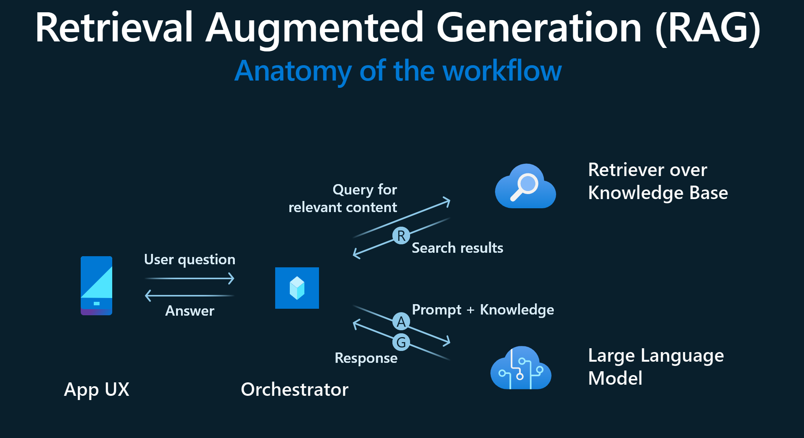
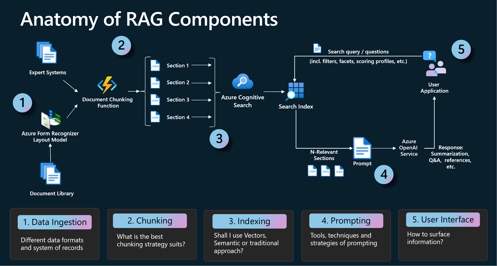

## Retrieval Augment Generation

Retrieval-augmented generation (RAG) for large language models (LLMs) aims to improve prediction quality by using an external datastore at inference time to build a richer prompt that includes some combination of context, history, and recent/relevant knowledge.

### In Azure, RAG pattern is implemented with following components

